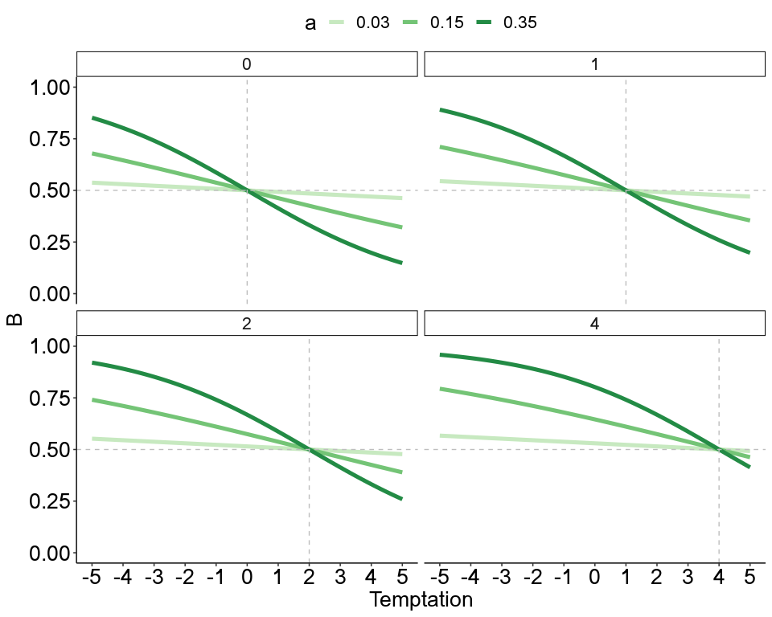
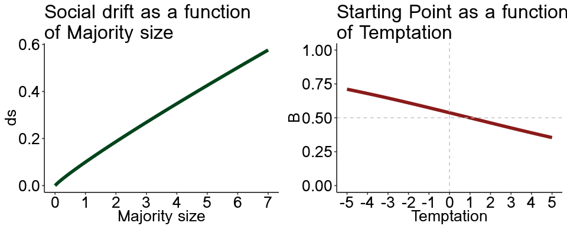
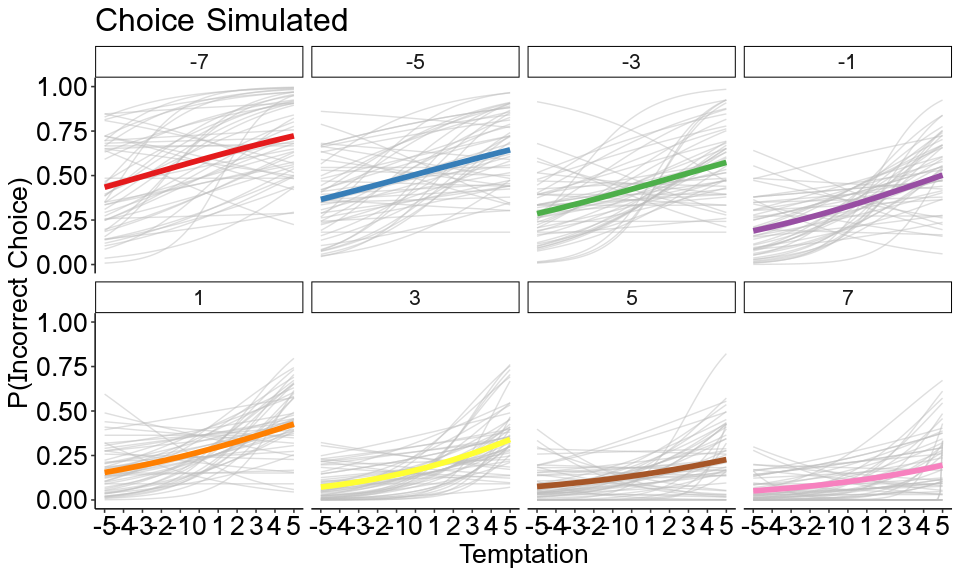
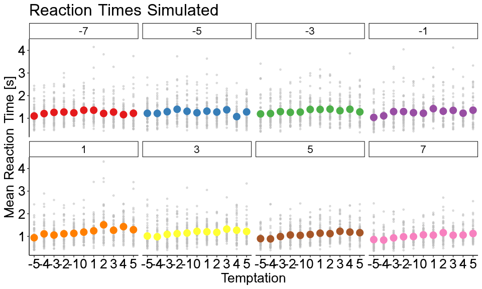
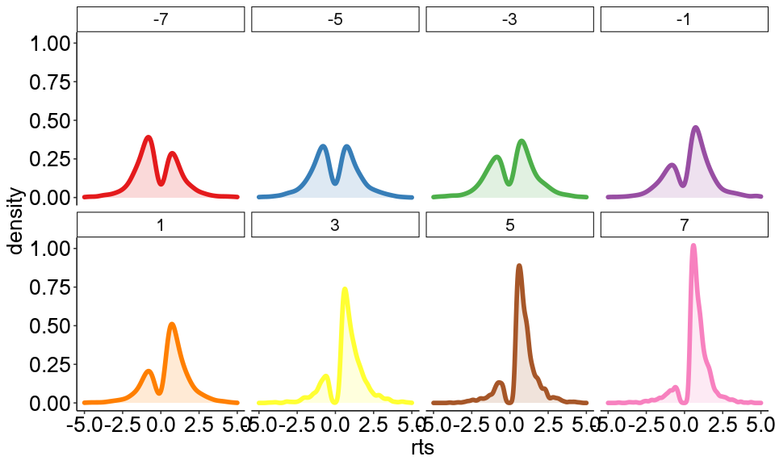
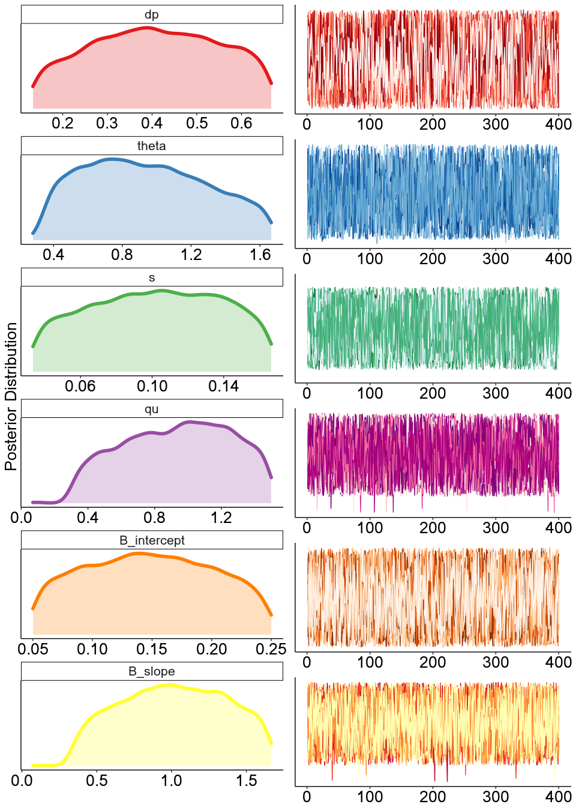
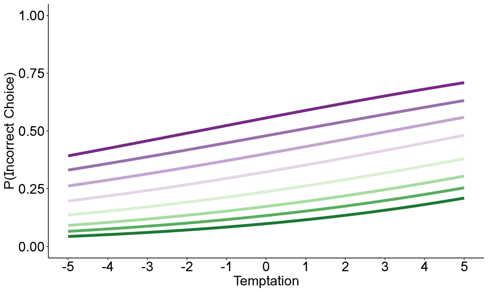
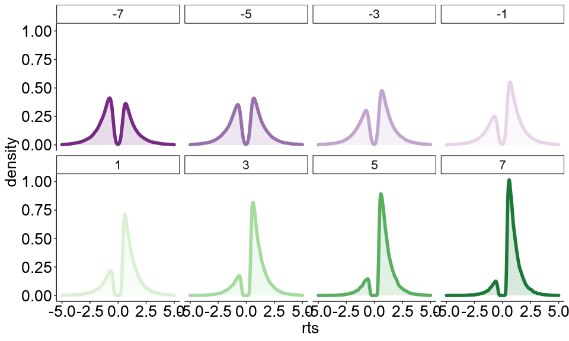
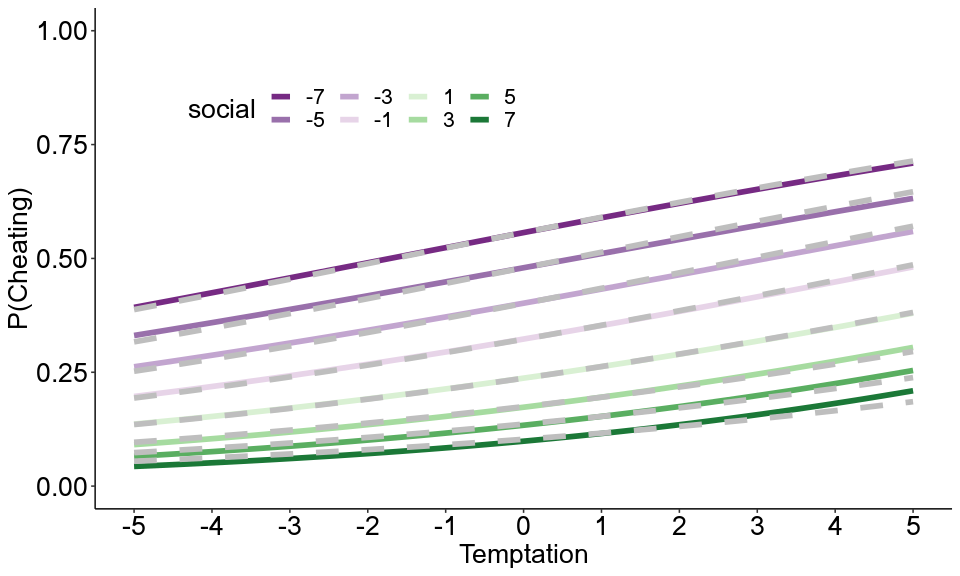
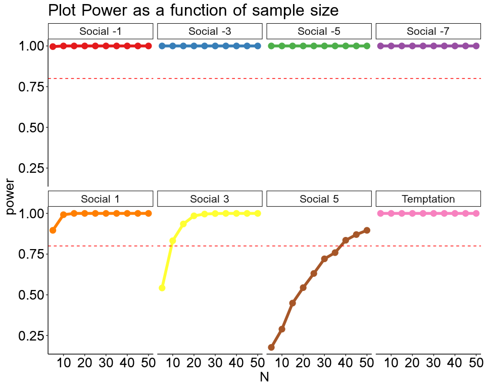

# sDDM


<br>

<font size="5"> **Introduction** </font>

In this document I will be presenting a power analysis which contains
Nine levels of the “Social Information” variable: {Control, 0 vs 7 - 1
vs 6 - 2 vs 5 - 3 vs 4 - 4 vs 3 - 2 vs 5 - 1 vs 6 - 0 vs 7}.

Furthermore, I generated artificial data using the sDDM the aim of:
first, trying to retrieve the parameters used to generate the data and
second, use the effect size that emerges from these simulations to
estimate the power of mixed effects logistic regression models.

<br>

<font size="5"> **Experimental Design** </font>

<br>

The experimental design I have in mind is a 11 x 9, where 11 are the
levels of the temptation variable {-5, -4, -3, -2, -1, 0, 1, 2, 3, 4, 5}
and 9 the levels of the social information variable {-7, -5, -3, -1, 1,
3, 5, 7}.

<br> <br> <br>

<font size="5"> **Starting point as a function of Temptation** </font>

<br>

<div style="text-align: justify;">
A prediction that we can formulate is that higher levels of temptation lead to an higher self-serving choice rate. One of the main hypothesis of this work is that self-serving choices are explained by changes in the sDDM Starting Point. It is possible to define the relationship between temptation and starting point using a logistic function: B = logit( a × (Temptation - b) ), where *B* is the starting point, *a* is a free parameter that represents how sensitive the “Starting Point” is to changes in “Temptation” and *b* is a free parameter that represents how strong must the temptation be increase the self-serving choice rate. Note that: 1. A starting point of 0.5 represent a starting point equally distant between the two bounds. Consequently, the model predicts that a B lower (higher) than 0.5 leads to an higher (lower) rate of self-serving choices. 2. The parameter b has a crystalline and directly interpretable meaning: b = 0 indicates that as soon as the temptation is greater than 0 the participant starts choosing the self-serving alternative, b = 1 indicates that as soon as the temptation is greater than 1 the participant starts choosing the self-serving alternative, b = 1.5 indicates that as soon as the temptation is greater than 1.5 the participant starts choosing the self-serving alternative, and so on… The parameter *a* indicates how
strong the change in the self-serving choice rate will be. I think that representing the relationship between temptation and starting point with this logistic function is an very interesting tool to investigate individual differences regarding how much and when a person is willing to make dishonest choices.
</div>


``` r
B_intercept <- c(0.03, 0.15, 0.35)
B_slope <- c(0, 1, 2, 4)
Temptation <-  seq(-5, 5, 0.1)

user::df_lapply( seq_along(B_slope), function(j){ user::df_lapply(seq_along(B_intercept), function(i){ 
  data.frame( B = 1/(1+exp(B_intercept[i]*(Temptation-B_slope[j]) )), 
              x = Temptation, B_intercept = as.character(B_intercept[i]), 
              B_slope = as.character(B_slope[j]) ) 
}) }) %>% mutate(x_line=case_when(
  B_slope=='0'~0, B_slope=='1'~1, B_slope=='2'~2, B_slope=='4'~4,
)) %>% 
  ggplot(aes(x, B, color=B_intercept)) + 
  geom_line(size=1.8) +
  scale_color_manual(values = RColorBrewer:::brewer.pal(n=9, name = "Greens")[c(3, 5, 7, 9)]) +
  scale_x_continuous(limits = c(-5, 5), breaks = -5:5) +
  scale_y_continuous(limits = c(0, 1)) +
  geom_hline(yintercept = 0.5, color='gray', linetype=2) +
  geom_vline(aes(xintercept = x_line), color='gray', linetype=2) +
  ggpubr::theme_pubr() +
  theme + labs(x='Temptation', color='a') +
  facet_wrap(~B_slope, nrow = 2)
```



<br>

<font size="5"> **Generate Artificial Data using the social drift
diffusion model** </font>

<br>

According the the sDDM, At each time step *Δ**t*, the current state of
evidence L(t) is updated by sampling new evidence until a decision is
made (until the level of evidence reaches a choice threshold *θ*)

<br>
<div style="text-align: center;">

L(t + Δt) = L(t) + [δ<sub>p</sub> + δ<sub>s</sub>] × Δt + √Δt × ϵ


<br>

<div style="text-align: justify;">

where *ϵ* is Gaussian white noise with a mean of 0 and a variance of 1.
The parameters *δ*<sub>*p*</sub> and *δ*<sub>*s*</sub>
correspond to the strength of the personal and social information
uptake, respectively. The social drift *δ*<sub>*s*</sub> is computed as
follow:

<br>
<div style="text-align: center;">

*M* = *N*<sub>*A*</sub> − *N*<sub>*B*</sub>

<br>

*δ*<sub>*s*</sub> = *s* × *M*<sup>*q*</sup>

<br>

<div style="text-align: justify;">

where M is the majority size *N*<sub>*A*</sub> and *N*<sub>*B*</sub> are
the number of individuals who have already decided for option A
(Correct) or B (Incorrect), respectively, *s* is a scaling factor that
influences the strength of the social drift and *q* governs the shape of
the power function.

I generated artificial data using the following group level parameters:
*δ*<sub>*p*</sub> = 0.4, *θ* = 1, *a* = 0.15, *b* = 1, *q* = 0.9,
*s* = 0.1, *τ* = 0.3. To generate individual differences i simulate 50
subjects using each parameter sampled from a the following probability
distributions: *δ*<sub>*p*</sub>*s* ∼ *N*(*δ*<sub>*p*</sub>, 0.1),
*θ* ∼ *N*(*θ*, 0.1), *a*<sub>*s*</sub> ∼ *N*(*a*<sub>*p*</sub>, 0.1),
*b*<sub>*s*</sub> ∼ *N*(*b*<sub>*p*</sub>, 0.1),
*q*<sub>*s*</sub> ∼ *U*(*q* − *q*/2, *q* + *q*/2),
*s*<sub>*s*</sub> ∼ *U*(*s* − *s*/2, *s* + *s*/2). For each participant,
I simulated 3 trials per cell, having 8 (social info) x 11 (temptation)
x 3 (n trials per cell) = 246 trials per participant.

``` r
s=0.1; qu=0.9
social_drift<-data.frame(social=seq(-7, 7, 0.1), ds = s * seq(-7, 7, 0.1)^qu) %>% 
  ggplot(aes(social, ds)) +
  geom_line(color=RColorBrewer:::brewer.pal(n=9, name = "Greens")[9], size=2)+
  theme_pubr() + theme +
  labs(x='Majority size', title = 'Social drift as a function \nof Majority size') +
  scale_x_continuous(limits = c(0, 7), breaks = 0:7)

B_intercept=0.15; B_slope=1
starting_point<-data.frame(temptation=seq(-5, 5, 0.1), 
           B = 1/(1+exp(B_intercept*(seq(-5, 5, 0.1)-B_slope)))
) %>% ggplot(aes(temptation, B)) +
  geom_line(color='firebrick4', size=2)+
  theme_pubr() + theme +
  geom_hline(yintercept = 0.5, linetype=2, color="gray") +
  geom_vline(xintercept = 0, linetype=2, color="gray") +
  scale_y_continuous(limits = c(0,1)) +
  scale_x_continuous(breaks = -5:5) +
  labs(x='Temptation', title = 'Starting Point as a function \nof Temptation')

ggarrange(social_drift, starting_point, nrow = 1)
```



<br>

``` r
### Simulate sDDM Data ###
df_lapply=function(X, FUN) do.call(rbind.data.frame, lapply(X, FUN)) %>% tibble::as_tibble()
RcppParallel::setThreadOptions(numThreads = 1) #this is critical for running on Mac OS for some reason.

social_info=seq(-7, 7, 2)
temptation=-5:5
n_trial=3; #print(paste('Each participant has to complite', n_trial*length(social_info)*length(temptation) ,'trials'))
n_subject=50

#Create variable with n_trial per cell
social=rep(social_info, each=n_trial)

#Replicate social for each temptation level
social_temptation=df_lapply(1:length(temptation), function(t_i) data.frame(social=social, temptation=temptation[t_i] ))

#Replicate social_temptation for each subject
data_sim=df_lapply(1:n_subject, function(s_i) rbind(cbind(data.frame(Subject=s_i), social_temptation)))

##### Simulate choice and rts #####
Rcpp::sourceCpp('Functions/rsddm.cpp')

nDT=0.3; dt=0.005
#Group Parameters
dp=.4; B_intercept=0.15; B_slope=1; theta=1; qu=0.9; s=0.1
#Subject Parameters
dp_s=rnorm(n_subject,dp,0.1); B_intercept_s=rnorm(n_subject,B_intercept,0.1); B_slope_s=rnorm(n_subject,B_slope,0.1)
theta_s=rnorm(n_subject,theta,0.1); qu_s=runif(n_subject,qu-qu/2,qu+qu/2); s_s=runif(n_subject,s-s/2,s+s/2)

rts=lapply(1:n_subject, function(s_i){
  data=data_sim[data_sim$Subject==s_i, ]
  dp=dp_s[s_i]; B_intercept=B_intercept_s[s_i]; B_slope=B_slope_s[s_i]; theta=theta_s[s_i]; qu=qu_s[s_i]; s=s_s[s_i]
  sapply(1:nrow(data), function(row_i){
    sddm_parallel(dp=dp, theta=theta, nDT=nDT, B_intercept = B_intercept, B_slope = B_slope, 
                  temptation = data$temptation[row_i], social_strength=data$social[row_i], 
                  dt=dt, qu=qu, s=s, N=1)
  })
}) %>% unlist

data_sim=data_sim %>% mutate(rts=rts, choice=ifelse(rts<0, 0, 1), rts=abs(rts))

# Plots 
data_sim %>% 
  mutate(social=factor(social, labels = seq(-7, 7, 2)), Subject=factor(Subject),
         choice=ifelse(choice==0, 1, 0)) %>%  #Change choice if we wnat to plot the probability of cheating
  ggplot() +
  stat_smooth(aes(temptation, choice, group=Subject), geom='line', alpha=0.5, se=FALSE, method = 'glm', color='gray', alpha=0.2, method.args=list('binomial'))+
  geom_smooth(aes(temptation, choice, color=social), method = 'glm', method.args=list('binomial'), se=F, size=2) +
  theme_pubr() + theme +
  scale_color_brewer(palette = 'Set1') +
  scale_x_continuous(breaks = -5:5) +
  scale_y_continuous(limits = c(0, 1)) +
  labs(x="Temptation", y="P(Incorrect Choice)", title = "Choice Simulated") +
  facet_wrap(~social, nrow = 2) + theme(legend.position="none")
```



``` r
ggplot() +
  geom_point(data=data_sim %>% 
               Rmisc::summarySEwithin(., measurevar = "rts", withinvars = c("social", "temptation", "Subject")) %>% 
               mutate(temptation=as.numeric(as.character(temptation))),
             aes(temptation, rts, group=Subject), size=1, color="gray", alpha=0.5
  ) +
  geom_pointrange(data=data_sim %>% 
                    Rmisc::summarySEwithin(., measurevar = "rts", withinvars = c("social", "temptation")) %>% 
                    mutate(temptation=as.numeric(as.character(temptation))),
                  aes(temptation, rts, ymin=rts-se, ymax=rts+se, color=social), size=1) +
  labs(x="Temptation", y="Mean Reaction Time [s]", title = "Reaction Times Simulated") +
  scale_x_continuous(breaks = -5:5) +
  theme_pubr() + theme + theme(legend.position='none') +
  scale_color_brewer(palette = 'Set1') +
  facet_wrap(~social, nrow = 2)
```



``` r
data_sim %>% 
  mutate(rts=ifelse(choice==1, rts, -rts), social=factor(social)) %>% 
  ggplot(aes(rts, color=social, fill=social)) +
  geom_density(size=2, alpha=1/6) +
  scale_x_continuous(limits = c(-5,5)) +
  theme_pubr() + theme + theme(legend.position='none') +
  scale_color_brewer(palette = 'Set1') +
  scale_fill_brewer(palette = 'Set1') +
  facet_wrap(~social, nrow = 2)
```



<br>

<font size="5"> **Parameters Recovery** </font>

<br>

I recovered the parameters using a bayesian hierarchical approach.
Specifically, I implemented a Differential-Evolution MCMC algorithm
(Turner, Sederberg, Brown & Steyvers, 2013). Below are reported the
means of the posterior distribution estimated for each group parameter.

``` r
######## Plot MCMC Results #########
load(file = "Data/fit_s.RData"); library(RColorBrewer)

chain_length=6000; burnin=2000; thining=10; par_chains=24; cores=4
n_subject=50; Subjects=1:n_subject

#Create Parent Posterior data_plot
avg_dp=c(); avg_theta=c(); avg_qu=c(); avg_s=c(); avg_B_intercept=c(); avg_B_slope=c();
for(cp in 1:par_chains) avg_dp=c(avg_dp, fit_s[[3]][[cp]][, 1])
for(cp in 1:par_chains) avg_theta=c(avg_theta, fit_s[[3]][[cp]][, 2])
for(cp in 1:par_chains) avg_s=c(avg_s, fit_s[[3]][[cp]][, 3])
for(cp in 1:par_chains) avg_qu=c(avg_qu, fit_s[[3]][[cp]][, 4])
for(cp in 1:par_chains) avg_B_intercept=c(avg_B_intercept, fit_s[[3]][[cp]][, 5])
for(cp in 1:par_chains) avg_B_slope=c(avg_B_slope, fit_s[[3]][[cp]][, 6])

iteration = rep(1:((chain_length-burnin)/thining), par_chains)
iteration_s = rep(iteration, n_subject)

chain = rep(1:par_chains, each=((chain_length-burnin)/thining))
chain_s = rep(chain, n_subject)

data_plot_avg = data.frame(dp=avg_dp,
                           theta=avg_theta,
                           s=avg_s,
                           qu=avg_qu,
                           B_intercept=avg_B_intercept,
                           B_slope=avg_B_slope,
                           iteration=iteration, chain=factor(chain))

apply(data_plot_avg[,1:6], 2, mean)
```

    ##          dp       theta           s          qu B_intercept     B_slope 
    ##   0.4062609   0.9416910   0.1028893   0.9343035   0.1482966   1.0149584

<br>

<div style="text-align: center;">

<font size="3"> **Posterior distributions of each group parameter**
</font>

<div style="text-align: justify;">


``` r
post=reshape::melt(data = data_plot_avg, id=c('chain', 'iteration')) %>% 
  .[!(.$variable=='s' & .$value>0.18), ] %>%
  .[!(.$variable=='B_intercept' & .$value>0.3), ] %>% 
  ggplot() +
  geom_density(aes(value, color=variable, fill=variable), size=2, alpha=1/4) +
  ggpubr::theme_pubr() + 
  theme + theme(legend.position = "none", 
                axis.text.y=element_blank(),
                axis.ticks.y=element_blank()) + 
  labs(y='Posterior Distribution') +
  facet_wrap(~variable, ncol = 1, scale='free') +
  scale_color_brewer(palette = 'Set1') +
  scale_fill_brewer(palette = 'Set1') +labs(x="")

#Plot dp
c1=data_plot_avg %>%
  ggplot(aes(iteration, dp, color=chain)) +
  geom_line() +
  ggpubr::theme_pubr() +
  scale_color_manual(values = sample(brewer.pal(n = 8, name = "Reds"), 24, replace = T)) +
  theme + theme(legend.position = "none", 
                axis.title.x=element_blank(),
                axis.title.y=element_blank(),
                axis.text.y=element_blank(),
                axis.ticks.y=element_blank()) 

#theta
c2=data_plot_avg %>%
  ggplot(aes(iteration, theta, color=chain)) +
  geom_line() +
  ggpubr::theme_pubr() + 
  scale_color_manual(values = sample(brewer.pal(n = 8, name = "Blues"), 24, replace = T)) +
  theme + theme(legend.position = "none", 
                axis.title.x=element_blank(),
                axis.title.y=element_blank(),
                axis.text.y=element_blank(),
                axis.ticks.y=element_blank()) 
#s
c3=data_plot_avg %>%
  ggplot(aes(iteration, s, color=chain)) +
  geom_line() +
  ggpubr::theme_pubr() + scale_y_continuous(limits = c(0.02, 0.18)) +
  scale_color_manual(values = sample(brewer.pal(n = 8, name = "BuGn"), 24, replace = T)) +
  theme + theme(legend.position = "none", 
                axis.title.x=element_blank(),
                axis.title.y=element_blank(),
                axis.text.y=element_blank(),
                axis.ticks.y=element_blank()) 

#qu
c4=data_plot_avg %>%
  ggplot(aes(iteration, qu, color=chain)) +
  geom_line() +
  ggpubr::theme_pubr() + 
  #scale_y_continuous(limits = c(0.05, 0.25)) +
  scale_color_manual(values = sample(brewer.pal(n = 8, name = "RdPu"), 24, replace = T)) +
  theme + theme(legend.position = "none", 
                axis.title.x=element_blank(),
                axis.title.y=element_blank(),
                axis.text.y=element_blank(),
                axis.ticks.y=element_blank())

#B_interpect
c5=data_plot_avg %>%
  ggplot(aes(iteration, B_intercept, color=chain)) +
  geom_line() +
  ggpubr::theme_pubr() + 
  scale_y_continuous(limits = c(0.05, 0.25)) +
  scale_color_manual(values = sample(brewer.pal(n = 8, name = "Oranges"), 24, replace = T)) +
  theme + theme(legend.position = "none", 
                axis.title.x=element_blank(),
                axis.title.y=element_blank(),
                axis.text.y=element_blank(),
                axis.ticks.y=element_blank())

#Slope
c6=data_plot_avg %>%
  ggplot(aes(iteration, B_slope, color=chain)) +
  geom_line() +
  ggpubr::theme_pubr() + 
  scale_color_manual(values = sample(brewer.pal(n = 6, name = "YlOrRd"), 24, replace = T)) +
  theme(legend.position = "none") +
  theme + theme(legend.position = "none", 
                axis.title.x=element_blank(),
                axis.title.y=element_blank(),
                axis.text.y=element_blank(),
                axis.ticks.y=element_blank())

cn=ggarrange(c1, c2, c3, c4, c5, c6, ncol = 1)
ggarrange(post, cn, nrow = 1)
```



<div style="text-align: justify;">

<br>

<font size="5"> **Power Analysis** </font>

<br>

I performed a power analysis using the effects generated by this
simulation. I would be happy to discuss the plausibility of these
effects with you!

Let’s take a look again at the data simulated with sDDM.

``` r
source('Functions/functions.R')

n_trial=5000
social=seq(-7, 7, 2)
temptation=-5:5
social_temptation=expand.grid(social=social, temptation=temptation) #All possible combination [Exept for the control condition]

#Load rsDDM function
Rcpp::sourceCpp('Functions/rsddm.cpp')
#Define Parameters
dp=.4; B_intercept=0.15; B_slope=1; theta=1; qu=0.9; s=0.1; nDT=0.3; dt=0.005

rts=lapply(1:nrow(social_temptation), rsDDM, data=social_temptation, N=n_trial)

#Create dataset
data_sim = lapply(1:nrow(social_temptation), 
                  function(i){ cbind(social_temptation[i, ], choice=ifelse(rts[[i]]<0, 1, 0), rts=abs(rts[[i]]) ) 
                  }) %>% do.call(rbind.data.frame, .) %>% mutate(social=factor(social, labels = seq(-7, 7, 2)))
```

``` r
load('Data/data_simulated.RData')
data_sim %>% 
  ggplot() +
  geom_smooth(aes(temptation, choice, color=social), method = 'glm', method.args=list('binomial'), se=F, size=2) +
  theme_pubr() + theme +
  scale_color_brewer(palette = 'PRGn')+
  scale_x_continuous(breaks = -5:5) +
  scale_y_continuous(limits = c(0, 1)) +
  labs(x="Temptation", y="P(Incorrect Choice)") +
  theme(legend.position = "none")
```



``` r
data_sim %>% 
  mutate(rts=ifelse(choice==1, -rts, rts)) %>% 
  ggplot(aes(rts, color=social, fill=social)) +
  geom_density(size=2, alpha=1/6) +
  scale_x_continuous(limits = c(-5,5)) +
  theme_pubr() + theme + theme(legend.position = "none") +
  scale_color_brewer(palette = 'PRGn')+
  scale_fill_brewer(palette = 'PRGn') +
  facet_wrap(~social, nrow = 2)
```



Then I fitted a Logistic regression to the simulated data and plot
results (gray dotted line represent the choices predicted by the
logistic regression model)

``` r
#############################   Recovery Logistic Parameters   #############################
#### Additive effect ####
fit_add=glm(choice ~ temptation+social, data=data_sim, family = 'binomial')
#Compare model with data
newdfr_add = expand.grid(temptation = seq(from = -5, to = 5, by = .01),
                     social = factor(social))
newdfr_add$choice = predict(fit_add, type = "response", newdata = newdfr_add)
#Plot
ggplot() +
  geom_smooth(data=data_sim, aes(temptation, choice, color=social), 
              method = 'glm', method.args=list('binomial'), se=F, size=2) +
  geom_line(data=newdfr_add, aes(temptation, choice, group=social), color='gray', size=2, linetype=2) +
  theme_pubr() + theme +
  scale_color_brewer(palette = 'PRGn')+
  scale_x_continuous(breaks = -5:5) +
  scale_y_continuous(limits = c(0, 1)) +
  labs(x="Temptation", y="P(Cheating)") +
  theme(legend.position = c(0.3, 0.8), legend.direction = "horizontal")
```



<br>

``` r
#############################   Compute Power   #############################
n_trials=3; lS=length(social); social=seq(-7, 7, 2); social_trials=rep(seq(-7, 7, 2), n_trial); temptation=-5:5
lTe=length(temptation)
social_temptation=expand.grid(social=social_trials, temptation=temptation); print(paste0("The number of trials is: ", 
                                                                                         nrow(social_temptation)))
#Predict
fit_add=glm(choice ~ temptation+social, data=data_sim, family = 'binomial')
b=fit_add$coefficients; Te=social_temptation$temptation; S=social_temptation$social

#Sample size calculation
N_set <- seq(5, 50, 5)
pow <- lapply( N_set, function(N_i){
  cat("Power calculation with", N_i, "subjects", "\r")
  pbmcapply::pbmclapply(1:1000, function(r){
    d<-lapply(1:N_i, simulate_data, n_trials = 3) %>% do.call(rbind.data.frame,.)
    d=within(d, social <- relevel(social, ref = '7'))
    return(test_model(d))
  }, mc.cores = 30) %>% do.call(rbind, .) %>% apply(., 2, mean) %>% as.data.frame() %>% 
    rename('power'='.') %>% cbind(N=N_i, par=c('T',"Sm7","Sm5","Sm3","Sm1","Sp1","Sp3","Sp5")) 
}) %>% do.call(rbind.data.frame, .); save(pow, file = "Results/pow2.RData")
```

Here I am considering social = 7 as reference point.

``` r
load('Data/pow2.RData')
pow %>% 
  mutate(par = case_when(
    par=='T'~'Temptation',
    par=='Sm7'~'Social -7',
    par=='Sm5'~'Social -5',
    par=='Sm3'~'Social -3',
    par=='Sm1'~'Social -1',
    par=='Sp1'~'Social 1',
    par=='Sp3'~'Social 3',
    par=='Sp5'~'Social 5',
  )) %>% 
  rename(Parameters = "par") %>% 
  ggplot(aes(N, power, color=Parameters)) +
  geom_line(size=2) +
  geom_point(size=4) +
  geom_hline(yintercept = 0.8 ,linetype=2, color="red") +
  scale_color_brewer(palette = 'Set1') +
  theme_pubr() + theme + labs(title = "Plot Power as a function of sample size") +
  facet_wrap(~Parameters, nrow = 2) + theme(legend.position="none")
```



<br><br>

**References**

B. M. Turner, P. B. Sederberg, S. D. Brown, M. Steyvers, A method for
efficiently sampling from distributions with correlated dimensions.
Psychol. Methods 18, 368–384 (2013).
